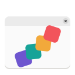

<h1 align="center">
  
  <br>
  Vivid Gradience
</h1>

<p align="center"><strong>Change the look of Adwaita, with ease.</strong></p>

<p align="center">
  <a href="https://github.com/superuser-miguel/Vivid_Gradience/actions/workflows/build.yml">
    
  </a>
</p>

## What is Vivid Gradience?

Vivid Gradience is a desktop app for customizing the look of **Libadwaita
applications** and the **adw-gtk3** theme. From a graphical interface — with no
hand-editing of config files — you can recolor the entire Adwaita palette,
generate a color scheme from your wallpaper, layer in custom CSS, and save or
share the result as a preset.

It is a maintained fork of [Gradience](https://github.com/GradienceTeam/Gradience),
whose original was archived in June 2024. This fork exists to keep the tool
alive on modern GNOME and to build on it.

## Where we are now

The project is **actively being revived**. This is early-stage work, so expect
some rough edges — issues and pull requests are welcome.

- [x] Builds and runs on the current GNOME runtime (**50**) as a Flatpak
- [x] Stays on the latest runtime automatically — a weekly job bumps the manifest
      and build-tests it before the change lands
- [x] Modernized, adaptive UI built on current libadwaita (`ToolbarView`,
      `Breakpoint`, boxed lists, `SwitchRow`/`EntryRow`)
- [x] **30+ ready-made themes** built in — Catppuccin, Gruvbox, Nord, Dracula,
      Rosé Pine, Everforest, Solarized, and more — in a visual preset gallery
      with per-theme color previews
- [x] Core theming from upstream is intact (colors, wallpaper-based schemes,
      presets, custom CSS)
- [ ] Further codebase cleanup and visual enhancements

## Screenshots

<p align="center">
  
</p>

<p align="center">
  
  &nbsp;
  
</p>

<!-- Add images to screenshots/ — see screenshots/README.md for the expected filenames. -->

## Features

- Pick from **30+ ready-made themes** — Catppuccin, Gruvbox, Nord, Dracula,
  Rosé Pine, Everforest, Solarized, Tokyo Night, and more — in a visual preset
  gallery, each card previewing the theme's own colors
- Recolor any part of the Adwaita theme with a color picker or hex values, in
  searchable, collapsible categories
- Generate a Material 3 color scheme from your wallpaper
- Apply themes to Libadwaita, GTK 4, and GTK 3 (via adw-gtk3) applications
- Create, save, and manage your own presets
- Extend styling with custom CSS
- Adaptive interface that scales from desktop down to narrow/mobile widths

## Roadmap

**Near-term**

- [x] Modernize the UI — `ToolbarView`, adaptive `Breakpoint` layout, boxed
      lists, `SwitchRow`/`EntryRow` (HIG polish ongoing)
- [ ] Track each new GNOME runtime release as it ships
- [ ] Verify every theming feature against the latest Libadwaita
- [ ] Clean up and modernize the codebase

**Planned**

- [x] Ready-made themes built in (Catppuccin, Gruvbox, Nord, Dracula, Tokyo Night)
- [ ] Show your own presets in the visual gallery (built-in schemes done)
- [ ] Color wheel for picking colors
- [ ] Import GTK 3/4 themes from external sources (OpenDesktop, GitHub, and others)
- [ ] Light/dark preset pairs
- [ ] Day-to-night gradient automation
- [ ] Full theme preview
- [ ] Generate a preset from a single color
- [ ] Textures (carbon fibre, gloss, and more)

The full list, including inherited features and plugins, lives in
[ROADMAP.md](ROADMAP.md).

## Theming setup

### Libadwaita applications

No setup is needed for native Libadwaita apps. For Flatpak apps, grant access to
the GTK 4 config:

- Run `sudo flatpak override --filesystem=xdg-config/gtk-4.0`, or
- Add `xdg-config/gtk-4.0` under **Filesystem → Other files** in
  [Flatseal](https://github.com/tchx84/Flatseal).

### GTK 3 applications

- Install the [adw-gtk3](https://github.com/lassekongo83/adw-gtk3#readme) theme.
- For Flatpak apps, grant `xdg-config/gtk-3.0` the same way as above.

## Reverting

Open **Preferences → Theming → Reset & Restore Presets** and reset GTK 3 or
Libadwaita.

<details>
<summary>Manual revert</summary>

```shell
rm -rf .config/gtk-4.0 .config/gtk-3.0
flatpak uninstall adw-gtk3
sudo flatpak override --reset
```

Note: `flatpak override --reset` clears **all** Flatpak overrides system-wide.

</details>

## Building from source

Requirements: `flatpak-builder`, `meson >= 0.59.0`, and the GNOME 50 SDK and
Platform runtime.

Flatpak (recommended):

```shell
git clone https://github.com/superuser-miguel/Vivid_Gradience.git
cd Vivid_Gradience
flatpak-builder --user --install --force-clean builddir \
  build-aux/flatpak/io.github.superuser_miguel.VividGradience.Devel.json
```

Local build:

```shell
meson setup builddir --prefix=$HOME/.local
ninja -C builddir install
```

See [HACKING.md](HACKING.md) for details.

## A note on theming

Vivid Gradience is a tool for tinkerers and is **not intended for distributions
to ship by default**. A unified Adwaita look matters for app developers; see
[stopthemingmy.app](https://stopthemingmy.app) for the reasoning.

## Acknowledgments

- [Artyom Fomin](https://github.com/ArtyIF) and
  [the Gradience Team](https://github.com/GradienceTeam) — the original Gradience
- [hydroxycarbamide](https://github.com/hydroxycarbamide/Gradience) — whose
  Gradience fork this project is based on
- [superuser-miguel](https://github.com/superuser-miguel) — reviving and
  modernizing the fork
- [Weblate](https://weblate.org) — translation platform
