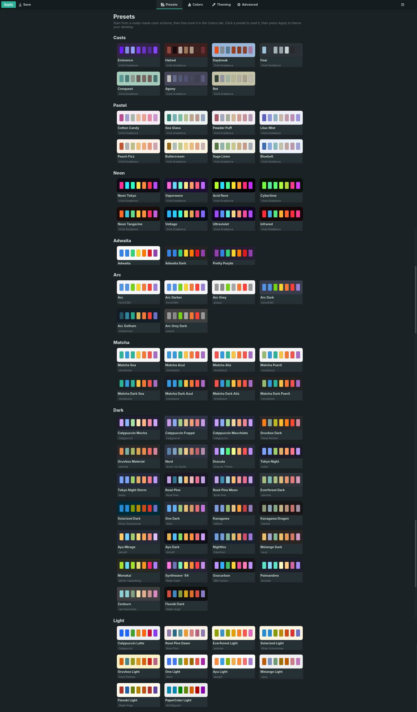
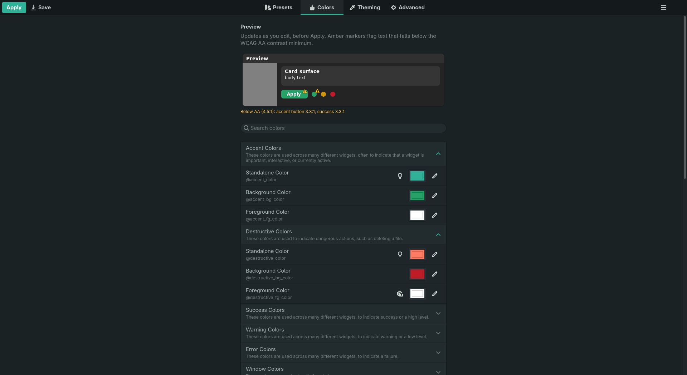
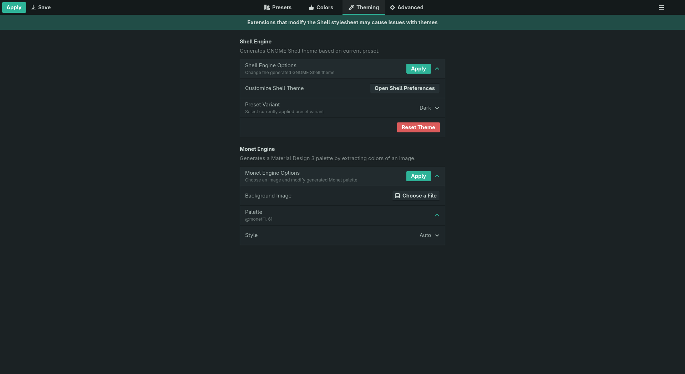
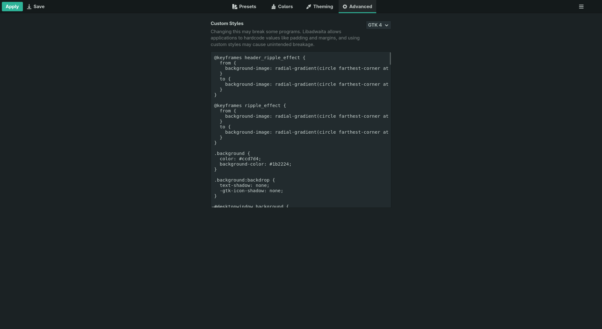
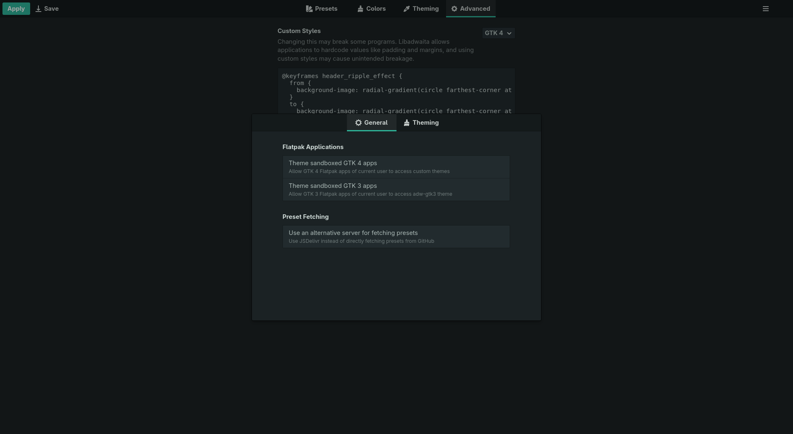

<h1 align="center">
  
  <br>
  Vivid Gradience
</h1>

<p align="center"><strong>Change the look of Adwaita, with ease.</strong></p>

<p align="center">
  <a href="https://github.com/superuser-miguel/Vivid_Gradience/actions/workflows/build.yml">
    
  </a>
</p>

## What is Vivid Gradience?

Vivid Gradience is a desktop app for customizing the look of **Libadwaita
applications**, the **adw-gtk3** theme, and **GNOME Shell**. From a graphical
interface — with no hand-editing of config files — you can recolor the entire
Adwaita palette, generate a Material You color scheme from your wallpaper, theme
the Shell to match, layer in custom CSS, and save or share the result as a preset.

It is a maintained fork of [Gradience](https://github.com/GradienceTeam/Gradience),
whose original was archived in June 2024. This fork exists to keep the tool
alive on modern GNOME and to build on it.

## Where we are now

The project is **actively being revived**. This is early-stage work, so expect
some rough edges — issues and pull requests are welcome.

- [x] Builds and runs on the current GNOME runtime (**50**) as a Flatpak
- [x] Stays on the latest runtime automatically — a weekly job bumps the manifest
      and build-tests it before the change lands
- [x] Modernized, adaptive UI built on current libadwaita (`ToolbarView`,
      `Breakpoint`, boxed lists, `SwitchRow`/`EntryRow`)
- [x] **76 ready-made themes** built in — Catppuccin, Gruvbox, Nord, Dracula,
      Rosé Pine, Everforest, Solarized and the full **Arc** and **Matcha**
      families, plus three original sets (**Pastel**, **Neon**, **Casts**) — in
      a visual preset gallery with per-theme color previews, grouped into
      family sections
- [x] **Live preview with contrast warnings** — a schematic window at the top of
      the Colors tab redraws as you edit and flags text below WCAG AA
- [x] **GNOME Shell theming works again, on any Shell version, and applies
      without logging out** — upstream dropped it after GNOME 44 because the old
      engine carried a copy of GNOME's stylesheet sources per release. It now
      recolors the stylesheet your installed Shell already ships, so it follows
      whatever GNOME you run
- [x] **Five theme engines** — Shell, Monet (wallpaper), **Firefox**, a
      **recolored icon theme** (folders stop staying Adwaita blue), and the
      **Desktop** pickers inherited from GNOME Tweaks, including the warning
      Tweaks never had: choosing a GTK 3 theme your Flatpak apps can't resolve
      says so, instead of silently splitting the desktop
- [x] **Your existing theme is never destroyed** — applying over a stylesheet
      Vivid Gradience didn't write offers to import it into your theme library
      first, and every Apply snapshots the previous state for restore
- [x] Core theming from upstream is intact (colors, wallpaper-based schemes,
      presets, custom CSS)
- [x] Installs and updates from a **signed, auto-updating Flatpak repo** (with a
      one-off bundle as a fallback), released independently of Flathub
- [ ] Further codebase cleanup and visual enhancements

## Screenshots

<p align="center">
  
</p>

<p align="center">
  
  &nbsp;
  
</p>

<p align="center">
  
  &nbsp;
  
</p>

More at **[superuser-miguel.github.io/Vivid_Gradience](https://superuser-miguel.github.io/Vivid_Gradience)**.

## Install

### Recommended — signed repo, automatic updates

Install from the project's own signed Flatpak repo, and new releases arrive
with `flatpak update`:

```shell
flatpak install --user https://superuser-miguel.github.io/Vivid_Gradience-repo/VividGradience.flatpakref
flatpak run io.github.superuser_miguel.VividGradience
```

> This subscribes you to the repo (like Flathub does), so `flatpak update` — or
> GNOME Software — pulls new versions automatically. Every release is signed
> with the project's GPG key.

### Alternative — one-off bundle

Prefer a single file with no remote? Download **`VividGradience.flatpak`** from
the [latest release](https://github.com/superuser-miguel/Vivid_Gradience/releases/latest):

```shell
flatpak install --user ./VividGradience.flatpak
flatpak run io.github.superuser_miguel.VividGradience
```

> The bundle has **no update path** — to move to a newer version, download it and
> reinstall (or switch to the signed repo above, which updates itself). Vivid
> Gradience is **not on Flathub** and is distributed independently.

## Features

- Pick from **76 ready-made themes** — Catppuccin, Gruvbox, Nord, Dracula,
  Rosé Pine, Everforest, Solarized, Tokyo Night and the full **Arc** and
  **Matcha** families, plus the original **Pastel**, **Neon** and **Casts**
  sets — in a visual preset gallery, each card previewing the theme's own colors
- Recolor any part of the Adwaita theme with a color picker or hex values, in
  searchable, collapsible categories
- Watch a **live preview** as you edit, before applying anything — it marks any
  text that falls below the WCAG AA contrast minimum
- Generate a Material You color scheme from your wallpaper — pick from nine
  scheme variants (Vibrant, Tonal Spot, Expressive, and more) and a contrast level
- **Theme GNOME Shell to match, applied to your running session** — the panel,
  overview, <kbd>Super</kbd>+<kbd>Tab</kbd> switcher, quick settings and
  notifications repaint immediately, with no logout. Requires the
  [User Themes](https://extensions.gnome.org/extension/19/user-themes/) extension
- **Theme Firefox's own chrome** to match the preset — toolbar, tabs and the
  new-tab page, in every profile that has
  [firefox-gnome-theme](https://github.com/rafaelmardojai/firefox-gnome-theme)
  installed (LibreWolf and Waterfox too)
- **Recolor Adwaita's icons to the preset** — folders, drives and mimetypes
  follow the scheme instead of staying stock blue; one click applies it, one
  click removes it
- **Pick your colors from the preset itself** — every color button opens the
  preset's own palette first, with the system dialog one click behind it
- **Desktop settings without Tweaks** — GTK 3 theme, cursor, dark style and
  window-button layout, with a warning when a chosen GTK 3 theme is one your
  Flatpak apps cannot resolve
- Apply themes to Libadwaita, GTK 4, and GTK 3 (via adw-gtk3) applications —
  **non-destructively**: a stylesheet Vivid Gradience didn't write is offered a
  place in your theme library instead of being overwritten, and every Apply is
  snapshotted for restore
- Create, save, and manage your own presets; manage your theme library from
  the Advanced tab
- Extend styling with custom CSS
- Adaptive interface that scales from desktop down to narrow/mobile widths

## Roadmap

**Near-term**

- [x] Modernize the UI — `ToolbarView`, adaptive `Breakpoint` layout, boxed
      lists, `SwitchRow`/`EntryRow` (HIG polish ongoing)
- [ ] Track each new GNOME runtime release as it ships
- [ ] Verify every theming feature against the latest Libadwaita
- [ ] Clean up and modernize the codebase

**Planned**

- [x] 76 ready-made themes built in, in a visual gallery with color previews
- [x] Live preview with WCAG AA contrast warnings
- [x] GNOME Shell theming, version-independent and applied live
- [x] Recolored icon theme per preset, generated and applied from the app
- [x] Firefox chrome theming, on top of
      [firefox-gnome-theme](https://github.com/rafaelmardojai/firefox-gnome-theme)
- [x] Desktop pickers (GTK 3 theme, cursor, dark style, window buttons) — the
      start of the appearance control center, so GNOME Tweaks isn't needed
- [x] Warn when a chosen GTK 3 theme is one Flatpak apps cannot resolve —
      the split that otherwise happens silently
- [x] Never destroy an existing theme — Apply offers to import a foreign
      stylesheet into the theme library it now manages (Advanced tab)
- [ ] **Next up** — a palette editor: open a preset's color family and assign
      swatches to roles yourself, with contrast measured as you choose
- [ ] Show your own presets in the visual gallery (built-in schemes done)
- [ ] Color wheel for picking colors
- [ ] Import GTK 3/4 themes from external sources (OpenDesktop, GitHub, and others)
- [ ] Light/dark preset pairs *(deferred — shares one unresolved design question
      with the cycle below)*
- [ ] Time-of-day theme cycle — rotate 2–4 presets across the day, on its own
      storage so it never overwrites your theme history *(deferred)*
- [ ] Preview with real widgets (see [findings](https://superuser-miguel.github.io/Vivid_Gradience/findings.html))
- [ ] Generate a preset from a single color
- [ ] Textures (carbon fibre, gloss, and more)

The full list, including inherited features and the theme engines, lives in
[ROADMAP.md](ROADMAP.md).

## Theming setup

### Libadwaita applications

No setup is needed for native Libadwaita apps. For Flatpak apps, grant access to
the GTK 4 config:

- Run `sudo flatpak override --filesystem=xdg-config/gtk-4.0`, or
- Add `xdg-config/gtk-4.0` under **Filesystem → Other files** in
  [Flatseal](https://github.com/tchx84/Flatseal).

### GTK 3 applications

- Install the [adw-gtk3](https://github.com/lassekongo83/adw-gtk3#readme) theme.
- For Flatpak apps, grant `xdg-config/gtk-3.0` the same way as above.
- **Install the Flatpak theme extension too** — this one is easy to miss:

  ```shell
  flatpak install flathub org.gtk.Gtk3theme.adw-gtk3
  ```

  A Flatpak cannot see `/usr/share/themes`, so a distribution-packaged theme is
  invisible to sandboxed applications. Without the extension your host apps get
  adw-gtk3 and every Flatpak silently falls back to stock Adwaita — a desktop
  split along packaging lines, with no error to tell you why. If some of your
  apps look right and others don't, this is usually the reason.

  adw-gtk3 is not optional for GTK 3 theming, incidentally: GTK 3's built-in
  Adwaita has its colors compiled into its rules, so overriding color names
  cannot reach it at all. [The measurements are here.](https://superuser-miguel.github.io/Vivid_Gradience/findings.html)

### GNOME Shell

Install the [User Themes](https://extensions.gnome.org/extension/19/user-themes/)
extension, then use the Shell engine in the **Theming** tab. The Shell repaints
on your running session — no logout.

### What needs restarting

Short version: **not your session.**

| Surface | To see a change |
| --- | --- |
| Panel, overview, app grid, <kbd>Super</kbd>+<kbd>Tab</kbd>, quick settings, notifications, lock screen | Nothing |
| A GTK or Libadwaita app | Reopen that app |
| X11 titlebars on apps that draw no decorations | Restart `mutter-x11-frames` |

Named colors are read once, when an application starts — so the app you're
looking at needs reopening, but the desktop around it does not.

## Reverting

Open **Preferences → Theming → Reset & Restore Presets** and reset GTK 3 or
Libadwaita.

<details>
<summary>Manual revert</summary>

```shell
rm -rf .config/gtk-4.0 .config/gtk-3.0
flatpak uninstall adw-gtk3
sudo flatpak override --reset
```

Note: `flatpak override --reset` clears **all** Flatpak overrides system-wide.

</details>

## Building from source

Requirements: `flatpak-builder`, `meson >= 0.59.0`, and the GNOME 50 SDK and
Platform runtime.

Flatpak (recommended):

```shell
git clone https://github.com/superuser-miguel/Vivid_Gradience.git
cd Vivid_Gradience
flatpak-builder --user --install --force-clean builddir \
  build-aux/flatpak/io.github.superuser_miguel.VividGradience.Devel.json
```

Local build:

```shell
meson setup builddir --prefix=$HOME/.local
ninja -C builddir install
```

See [HACKING.md](HACKING.md) for details.

## A note on theming

Vivid Gradience is a tool for tinkerers and is **not intended for distributions
to ship by default**. A unified Adwaita look matters for app developers; see
[stopthemingmy.app](https://stopthemingmy.app) for the reasoning.

## Acknowledgments

- [Artyom Fomin](https://github.com/ArtyIF) and
  [the Gradience Team](https://github.com/GradienceTeam) — the original Gradience
- [hydroxycarbamide](https://github.com/hydroxycarbamide/Gradience) — whose
  Gradience fork this project is based on
- [superuser-miguel](https://github.com/superuser-miguel) — reviving and
  modernizing the fork
- [Weblate](https://weblate.org) — translation platform
